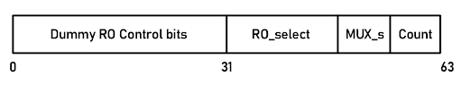

# General Overview

This folder contains the following contents:

- RTL netlist of the all-digital VT sensor

- Testbench of the digital sensor

- Scripts for generating the RO modules, the dummy module, the TDC module and testbench module

# Prerequisites

These circuits were designed using Cadence® Virtuoso®, Synopsys® Design Compiler®, Cadence® Innovus® and Mentor® Modelsim®. You must also separately obtain the TSMC 65/55nm GP PDK and ARM 65/55nm GP-based standard cell library, through MOSIS or a commercial license.

# RTL Code

The Verilog files in this folder are all RTL code with no device or standard cell infomation. All delay numbers are imaginary. Please replace the delay numbers according to the datasheet of your specific technology if necessary.

# Voltage/Temperature Sensor Tile Overview

The top module file is 'DigitalSensor_65_quadsensors.v', and the top module is DigitalVTSensor_chip_quadsensors_V8. In the top module, 4 sensors are daisy-chained together through SPI.

Each sensor contains the following functional modules:

- 9 mian Ring Oscillators

- Counter for counting ring-oscillator frequency

- Counter for counting SPI clock 

- 48-step TDC

- SPI 

- Dummy ROs

# __All-digital Voltage/Temperature Sensor__:

The digital voltage/temperature sensor is based on ARM 65nm GP-based standard cell library, compatible to 55nm libraries. This sensor contains:

## __Ring-oscillators__:
The ring-oscillators(RO) produces a square wave output whose period decreases when temperature increases or voltage increases. Total of 9 RO are included, the output is selected through a multiplexing logic.

## __16-bit Ripple Counter for Main RO__:
The 16-bit Ripple Counter transfers the square wave signal from the analog sensors to 16-bit digital output. 

## __48-step Time-to-digital Converter__:
The Time-to-digital Converter(TDC) captures the indicates the phase of the clock signal and acts as fine-readout.

The target clock is parallel with the counter and from the RO directly.

The reference clock is the inverse of the enable signal.

## __8-bit Ripple Counter for SPI Clock__:
The 8-bit Ripple Counter counts for SPI clock and send the corresponding signals.

- RO main counter control: 

This counter resets the main 16-bit counter during the first two SPI clock periods. The counter reset signal pulls to 1'b0 at first SPI clock and resets the main counter. Then the signal pulls back to 1'b1 and let the main counter run.

- Enable Signal:

This counter pulls the enable signal to 1'b1 at the 3rd SPI clock period and enable the chosen main RO. When reached the user's given number, it pulls the enable signal back to 1'b0 and stops the main RO from working.

- Overflow Flag:

It is possible that the SPI has too many clock periods for the 8-bit counter. Thus we added a overflow flag to make sure it only enables the main RO once.

- Reset:

This counter resets every time the SPI_CS signal is high(SPI is not working)

## __SPI__:

The SPI module is not a generalized SPI. The module is customized to reduce area consumption. SPI can be daizy-chained with other SPI modules that have the same operating mode.

### __Communication mode__:

- __CPOL = 0__:

SPI clock idles at 0, the leading edge is a rising edge.

- __CPHA = 0__:

The data change happens at the trailing edge.

### __Communication protocal__:

- __Code from SPI Master to SPI slave__: 

| Bit range       | Description           |
| :-----------:|:-------------:|
| 0-31      | Dummy RO control bits(each bit turns on 4 ROs) |
| 32-47      | Selects the main RO of the sensor(32-40)      |
| 48-55 | Controls MUX, choose RO output      |
| 56-63(LSB - MSB) |  Determines the counting period | 

- __Code from SPI slave to SPI master__: 

| Bit range       | Description           |
| :-----------:|:-------------:|
| 0-47      | TDC output |
| 32-47      | Main counter output |

## __SPI Multiplexing Logic__:

The SPI multiplexing logic switches the SPI communication between offchip and the microcontroller. This signal comes offchip through GPIO 'SPI_CTRL_PAD'. The states are as follow:

- when 1'b0, SPI connects to pad ring; 

- when 1'b1, SPI connects to the microcontroller;

- SPI_CTRL is always 1'b0 when RSTLOW is pulled to 0

# Pin List
Complete pin list of the sensor tile goes as following:
- RSTLOW_PAD: reset signal from offchip, resets the sensor at 1'b0
- SPI_CTRL_PAD: SPI swtiching signal from offchip
- SPI_MISO_PAD: SPI MISO output offchip
- SPI_MOSI_PAD: SPI MOSI input from offchip
- SPI_CLK_PAD: SPI clock signal from offchip
- SPI_CS_PAD: SPI slave select signal from offchip
- ENABLE_DUMMY_RO_PAD: Dummy RO enable signal from offchip, enables the selected dummy RO at 1'b1
- SPI_MISO_UC: SPI MISO output to the microcontroller
- SPI_MOSI_UC: SPI MOSI input from the microcontroller
- SPI_CLK_UC: SPI clock signal from the microcontroller
- SPI_CS_UC: SPI slave select signal from the microcontroller

# Testbench

The contained testbench is already loaded with a proper test case. If you would like to change the test case, we have provided a script to generate testbench conviniently. Please find the script in the 'Scripts' folder. 

Please select the resolution as 1ps while running testbench.

## Set up:
- 4 sensors are daisy-chained. The test case for each sensor is the same.
- Each SPI slave is 64-bit long
- The code needs to be inversed before giving to SPI slave (this also depends on how the SPI master reads the code.)
- The enable signal is turned on after 3 SPI clock periods, thus SPI counter number given in needs to be larger than 3.
- Need to run the same code multiple times. The first time will be the initialization and won't give the correct result.

## Initialization:
- RSTLOW = 0 resets the circuit, then sets to 1
- Enable_Dummy_RO = 0, sets to 1 to enable dummy ROs
- '_UC' stands for connection to the microcontroller, set all '_UC' to 1'b1 for testing purpose
- set 'SPI_CTRL_PAD' to 1'b0, so that SPI talks through the pad, isolating microcontroller input

## Test Cases:

### SPI Counter Testing:
1. Give different numbers to the SPI counter, the enable signal should last for corresponding periods. i.e. '0x0800,0000,0000,0000', the 'ENABLE_Sensor_RO' should be lasting for 5 SPI clock periods
2. Reset for the main counter should happen before the  'ENABLE_Sensor_RO' signal
3. Reset for SPI counter should happen while SPI_CS is high.

### Main RO test:
1. Fix the SPI counter to a certain number, i.e. '0x1800,0001,0000,0000'
2. Select each RO for every run, and choose the corresponding MUX input
- '0x1800,0001,0000,0000' for R1
- '0x1801,0002,0000,0000' for R2
- '0x1802,0004,0000,0000' for R3
- '0x1803,0008,0000,0000' for R4
- '0x1804,0010,0000,0000' for R5
- '0x1805,0020,0000,0000' for R6
3. The corresponding main RO should be running, MUX should output the waveform

### Counter/TDC test:
1. Set the code constant, i.e. '0x1804,0010,0000,0000'
2. The counter and TDC should give constant output after the first SPI talk.

### Dummy RO test:
1. Set the input code to '0x0000,0000,FFFF,FFFF'
2. Set Enable_Dummy_RO = 1'b1 after the first SPI communication
3. Every dummy RO should be working
4. Keep Enable_Dummy_RO = 1'b1, '0x0000,0000,0000,0000'
5. Every dummy RO should shut down.

### SPI slave testing:
1. MISO port from SPI slave should give the correct output
2. The SPI master is receiving the correct number from the slave
